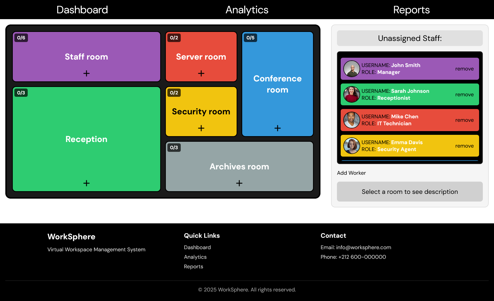

# WorkSphere — Virtual Workspace
An innovative, interactive web application designed for visual personnel management and floor plan organization.

Developed as part of the **DOM & Logic** brief at WorkSphere Corp.

---

## Table of Contents
- [Project Overview](#project-overview)
- [Educational Objectives](#educational-objectives)
- [Application Structure](#application-structure)
- [Screenshots](#screenshots)
- [Main Features (JavaScript)](#main-features-javascript)
- [Business Logic & Rules](#business-logic--rules)
- [Technologies Used](#technologies-used)
- [Development Workflow](#development-workflow)
- [Deployment](#deployment)
- [License](#license)

---

## Project Overview
**WorkSphere** is a modern management tool that allows companies to organize their staff on a virtual floor plan in real-time.

The goal of this project is to facilitate the distribution of employees across different workspaces while strictly enforcing role-based access constraints. It replaces static lists with a **dynamic, visual interface** where administrators can add staff, view details, and assign them to specific zones based on their professional roles.

The focus is on **complex DOM manipulation**, **business logic implementation**, **dynamic form handling**, and **responsive design**.

---

## Educational Objectives
- Master **DOM Manipulation** for dynamic content rendering (lists, cards, modals).
- Implement strict **Business Logic** to control user interactions based on roles.
- Build **Dynamic Forms** with repeatable fields (e.g., adding multiple work experiences).
- Create a fully **Responsive Layout** using CSS Grid and Flexbox for complex interfaces.
- Manage application state using **JavaScript Data Models** (Arrays/Objects).
- Develop custom **Modals and Overlays** without relying on external libraries.

---

## Application Structure
The interface is divided into two main interactive areas:

| Section | Description |
| :--- | :--- |
| **SIDEBAR** | Displays the **"Unassigned Staff"** list and the **"Add New Worker"** button. |
| **FLOOR PLAN** | The main visual stage featuring **6 distinct zones** (Conference Room, Reception, Server Room, etc.). |

**Global Features**:
- **Add Employee Modal**: A form to input personal details and dynamic work experience.
- **Profile Modal**: A detailed view of an employee's information.
- **Responsive Design**: Adapts from mobile (stacked view) to desktop (comprehensive dashboard).

---

## Screenshots

---

## Main Features (JavaScript)

### 1. **Dynamic Staff Management**
- **Add New Workers**: A comprehensive modal form to create new employee profiles.
- **Dynamic Form Fields**: Ability to add or remove multiple "Work Experience" entries dynamically within the form.
- **Live Photo Preview**: Real-time preview of the employee's photo URL before submission.

### 2. **Interactive Floor Plan**
- **Visual Assignment**: Users can assign "Unassigned" staff to specific zones using a dedicated "+" button in each room.
- **Occupancy Visualization**: Instantly see who is in which room with their name and photo.
- **Removal System**: A "X" button on assigned staff to instantly return them to the "Unassigned" pool.

### 3. **Smart Validation & Feedback**
- **Required Zones**: Logic to visually highlight mandatory zones (e.g., Reception, Server Room) in **pale red** if they are left empty.
- **Form Validation**: Prevents submission of incomplete profiles.

### 4. **Detailed Employee Profiles**
- **Profile Modal**: Clicking on any employee card opens a detailed view displaying:
    - Large format photo
    - Contact info (Email, Phone)
    - Full role and current location
    - Complete history of work experiences

---

## Business Logic & Rules
The core of WorkSphere is its strict adherence to company placement rules. The JavaScript ensures that employees can only be assigned to zones that match their roles:

| Zone | Authorized Roles |
| :--- | :--- |
| **Reception** | `Receptionist` Only |
| **Server Room** | `IT Technician` Only |
| **Security Room** | `Security Agent` Only |
| **Archives** | All roles **EXCEPT** `Cleaner` |
| **Conference Room** | Everyone |
| **Staff Room** | Everyone |
| **Manager Role** | Can access **ALL** zones |

*Note: Standard employees have free access to non-restricted zones.*

---

## Technologies Used

### Front-End
- **HTML5** — Semantic structure for accessibility.
- **CSS3** — Advanced **Grid** and **Flexbox** layouts. Custom color variables and responsive media queries (Mobile First approach).
- **JavaScript (Vanilla ES6+)** — State management, event listeners, complex logic, and DOM updates.

### Tools
- **Git & GitHub** — Version control.
- **Trello/Jira** — Project management and User Story tracking.
- **Visual Studio Code** — Development environment.

---

## Development Workflow
**Duration**: 5 days
**Methodology**: Agile / Scrum

**Process**:
1.  **Day 1: Foundation**
    * Set up HTML structure (Sidebar vs Main Plan).
    * Define JavaScript Data Models (Employee objects, Zone objects).
    * Build the "Add Employee" Modal.
2.  **Day 2: Visualization**
    * Render the "Unassigned Staff" list dynamically.
    * Build the CSS Grid layout for the 6-zone Floor Plan.
    * Implement dynamic "Work Experience" inputs.
3.  **Day 3: Logic & Assignment**
    * **Core Task**: Implement the Business Logic (Role vs. Zone).
    * Code the assignment system (moving staff from List to Zone).
    * Handle the "Remove" functionality.
4.  **Day 4: UI/UX Refinement**
    * Implement visual feedback (Red zones when empty).
    * Build the detailed "Profile Modal".
    * Desktop responsiveness and design system application.
5.  **Day 5: Mobile & Polish**
    * Full mobile and tablet responsiveness.
    * CSS animations for smooth transitions.
    * Code cleanup and Deployment.

---

## Deployment

**Live Site**: [Link to your GitHub Page](https://work-sphere-virtual-workspace-nine.vercel.app/)
**GitHub Repository**: [Link to your Repo](https://github.com/kara7z/WorkSphere---Virtual-Workspace)

Hosted on **GitHub Pages**.

---

## License
This project was developed for educational purposes.
© 2025 **WorkSphere**. All rights reserved.

---

**Organize. Visualize. Optimize.**
*WorkSphere — Transforming the way you see your workplace.*